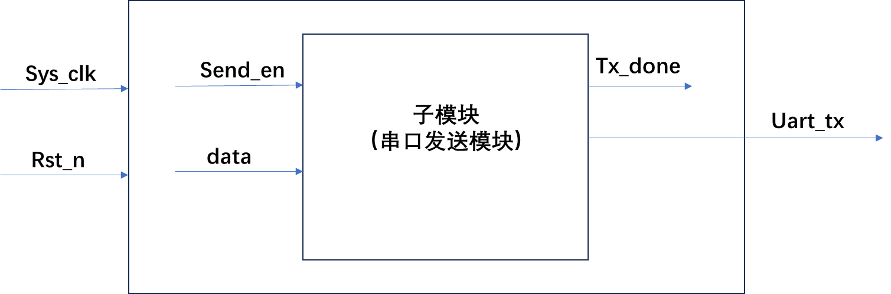
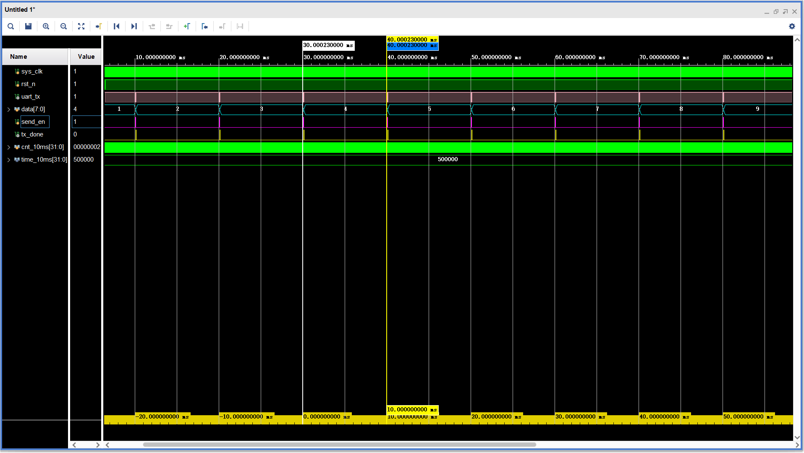
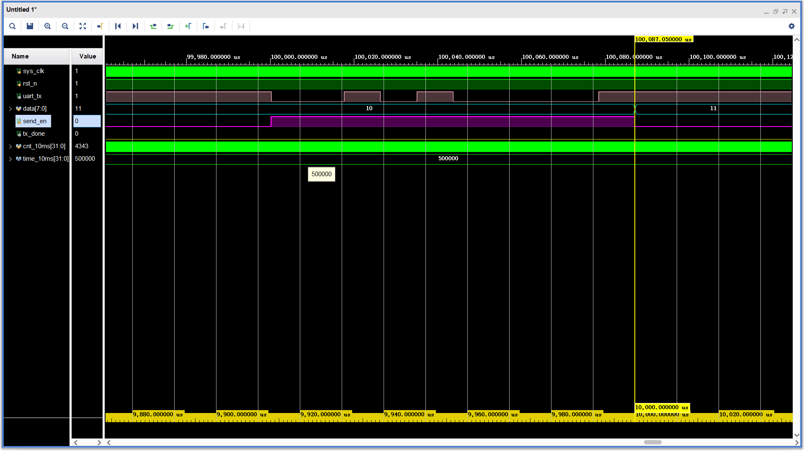

 
# 一、这是一篇描述怎么用串口发送数据的文章
## 1.设计思想稍微介绍一下
***这***个项目想要完成的效果是：每隔10ms ，用串口发送一次数据。
前一个项目完成了如何用串口发送8bit，这个项目是在前一个的基础上，写一个涵盖它的大模块。大模块把send_en、data信号传给子模块，子模块有了激励信号（而不用写这两个信号在tb文件里），串口模块里面就可以正常工作了。


这样使用双层模块，就可以将之前的模块利用起来，只发送uart_tx，相当于做了一层包装。
## 2.端口介绍
***大模块涵盖下面的端口 ↓***
``` verilog
input sys_clk,
input rst_n,
output uart_tx
```
***子模块涵盖下面的端口 ↓***
``` verilog
input sys_clk         ,          
input rst_n           ,          
input [2:0] time_set  ,   //基础计数器的设置       
input [7:0] data      ,          
input send_en         ,          
output reg uart_tx    ,          
output reg tx_done  
```
这是之前串口发送8bit的模块，这个模块在这次的项目中称作子模块。子模块中有两个输出，5个输入。在之前的项目中，子模块的三个输入 **↓** 是在tb文件里面写成了激励信号
``` verilog
input [2:0] time_set  , 
input [7:0] data      , 
input send_en         , 
``` 
* - 所以现在的大模块，把要send_en、data写好。
  - 又因为需要一个10ms计时器，所以需要再写一个cnt_10ms。
  - 总共三个模块要在大模块里写完：send_en、data、cnt_10ms
# 二、代码
(米娜桑只是字母多而已，一点也不复杂，给自己点信心)
## 1. 大模块设计代码
``` verilog
module byte_send(
input sys_clk,
input rst_n,
output uart_tx
);

reg [7:0] data        ;
reg send_en           ;
wire tx_done          ;

send_byte s1(   
.sys_clk      (sys_clk )   ,
.rst_n        (rst_n   )   ,
.time_set     (2)   ,
.data         (data    )   ,//之前是在tb文件里面给data，send_en，现在是在顶层模块给                            
.send_en      (send_en )   ,//顶层模块就是负责给子模块赋值的
.uart_tx      (uart_tx )   ,
.tx_done      (tx_done) 
);
/*--------------变量的声明-------------------*/
reg [31:0] cnt_10ms;
parameter time_10ms = 500_000;
/*-------------- 1 0 ms ---------------*/
always @(posedge sys_clk or negedge rst_n) begin
    if (!rst_n) begin
        cnt_10ms<=0;
    end
    else if (cnt_10ms==time_10ms-1) begin
        cnt_10ms<=0;
    end
    else
        cnt_10ms<=cnt_10ms+1;
end
/*--------------send_en--------------*/
always @(posedge sys_clk or negedge rst_n) begin
    if (!rst_n) begin
        send_en<=0;
    end
    else if (cnt_10ms== 1) begin
        send_en<=1'b1;
    end
    else if (tx_done) begin
        send_en<=0;
    end
    else
        send_en<=send_en;
end
/*--------------data--------------*/
always @(posedge sys_clk or negedge rst_n) begin
    if (!rst_n) begin
        data<=0;
    end
    else if (tx_done) begin
        data<=data+1;
    end
    else
        data<=data;
end
endmodule
```
## 2. 子模块设计代码
``` verilog
module send_byte (                           
input sys_clk         ,          
input rst_n           ,          
input [2:0] time_set  ,   //基础计数器的设置       
input [7:0] data      ,          
input send_en         ,          
output reg uart_tx    ,          
output reg tx_done  
    );
/*-----------------------变量的声明-----------------------------*/
reg [31:0] cnt;//基本计数器
reg [3:0] cnt2;//2级定时器 
reg [31:0] time_cnt;

/*-----------------------设置时间间隔-----------------------------*/ 
always@(*)
if(!rst_n)
    time_cnt<=434;
else
    case(time_set)  
        0:time_cnt<=10416;                 //4800; 
        1:time_cnt<=5208;                  //9600; 
        2:time_cnt<=434;                   //115200;
        default:time_cnt<=434;             //115200;
    endcase
/*-----------------------基本计数器-----------------------------*/
always@(posedge sys_clk or negedge rst_n)
if(!rst_n)
    cnt<=32'd0;
else if(send_en)
    if(cnt==time_cnt-1)
        cnt<=32'd0;
    else
        cnt<=cnt+1;
else//!send_en
    cnt<=32'd0;     
/*-----------------------2级计数器-----------------------------*/
always@(posedge sys_clk or negedge rst_n)
if(!rst_n)
    cnt2<=4'd0;//默认发start位
else if(send_en)begin
    if((cnt2>=0)&&(cnt2<10))begin
        if(cnt==time_cnt-1)
            cnt2<=cnt2+1;
        else  
            cnt2<=cnt2;
     end
     else if(cnt2==10)
        cnt2<=0;//cnt2的清零
     else  
            cnt2<=cnt2;
end
else //!send_en
    cnt2<=4'd0;
/*-----------------------uart_tx-----------------------------*/
always@(posedge sys_clk or negedge rst_n)
if(!rst_n)
    uart_tx<=0;
else if(send_en)
    case(cnt2)
        0: begin uart_tx<=0;  end                        
        1:  uart_tx<=data[0] ;                  
        2:  uart_tx<=data[1] ;                  
        3:  uart_tx<=data[2] ;                  
        4:  uart_tx<=data[3] ;                  
        5:  uart_tx<=data[4] ;                  
        6:  uart_tx<=data[5] ;                  
        7:  uart_tx<=data[6] ;                  
        8:  uart_tx<=data[7] ;                  
        9:  uart_tx<=1 ;       
        default:uart_tx<=1;    
      endcase
else//!send_en
    uart_tx<=uart_tx;                                          
/*-----------------------tx_done-----------------------------*/
always@(posedge sys_clk or negedge rst_n)
if(!rst_n)
    tx_done<=0;
else if(cnt2==9 && cnt == time_cnt-1)                                    
        tx_done<=1;     
else if(send_en)
        tx_done<=0;                
else
        tx_done<=0;
endmodule          
                               
```
## 3. 仿真代码
``` verilog
`timescale 1ns/1ps
module tb ;
reg  sys_clk;
reg  rst_n;  
wire uart_tx ;

byte_send b1(
. sys_clk(sys_clk),
. rst_n  (rst_n  ),  
. uart_tx(uart_tx) 
);
/*-----------------sys_clk-----------------*/
initial 
    sys_clk=0;
    always #10 sys_clk=~sys_clk;
/*-------------------rst_n-----------------*/
initial begin
    rst_n=0;
    #201
    rst_n=1;
    #500_000_0;
    $stop;
end 


endmodule

```
# 三、仿真现象

↓

可以看出：send_en的周期是10ms  ✓

 ↓

可以看出：tx_done持续了20ns  


↓

可以看出：uart_tx也的确是10——先开头拉低一位，紧接着是：低高低高低低低低，先从低位开始发的，所以对应2进制数字是:0000_1010;

~~现在我的好多同学都在考研，我一直想找个研究fpga的工作，最近在做简历，投了很多公司，但是没有音讯还，我想多多练习口语，加油，我可以是一个好牛马的~~


